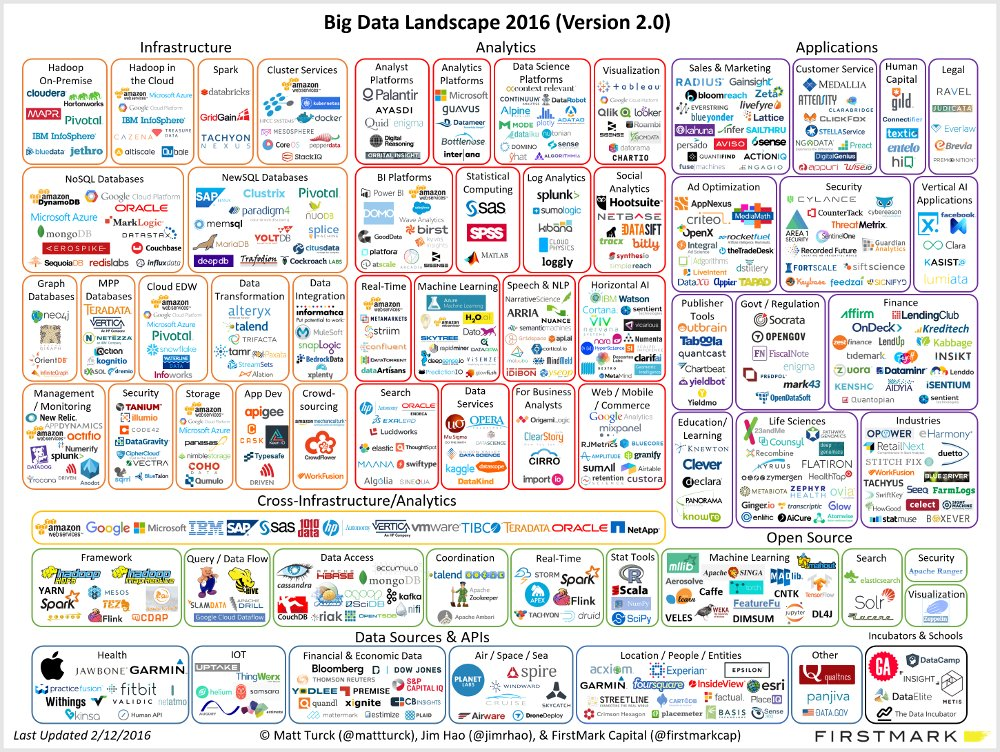
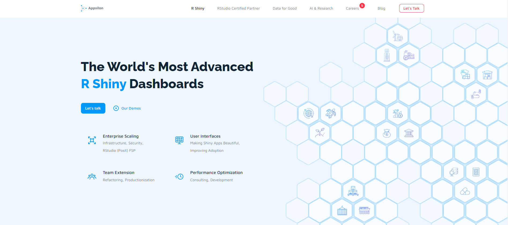

```{r setup, include=FALSE}
options(htmltools.dir.version = FALSE)

knitr::opts_chunk$set(echo = FALSE)
```

# Introdução

- Em 1976 o **estatístico** John Chambers e colegas criam o S. A linguagem C foi criada por volta de 1972.

  - A recepção da comunidade foi ótima.
  
- Na década de noventa outros **estatísticos** iniciam uma nova implementação do S: a linguagem R. A linguagem se consolida.

- O foco da linguagem sempre foi disponibilizar software para análise de dados.

- R e seus antepassados são quase tão antigos quanto a expressão **data science**.

---

# Big Data, Machine Learning, Data Science, IA etc...

```{r, out.width="80%", fig.align="center"}

```

---

# Data Science na vida real

- Essa sopa de letrinhas às vezes tira o foco do verdadeiro trabalho:

    - Garantir fluxos de ingestão de dados (**Engenharia**)
        - Rapidez 
        - Qualidade
        
    - Manipular dados para descobrir fatos e responder perguntas
        - Velocidade
        - Capacidade de análise
        - Estratégia
        
    - Produzir números e ações com base nos dados
        - Modelagem
        - Ingestão "ao contrário", __deploy__

Praticamente todo o ecossistema de Data Science se ocupa dessas funções acima, com diferentes filosofias e vantagens

---

# Data Science na vida real | Mais detalhes

- Garantir fluxos de ingestão de dados:

    - Existe um repositório central de dados para análise, usualmente conhecido como _data warehouse_. Frequentemente é necessário distinguir entre um _data lake_, com muita informação que **pode** ser usada e um **data warehouse**.
    
    - Principal tarefa é a gestão de **pipelines**
    
    - Dados são armazenados nas mais variadas infraestruturas de dados, mas usualmente o trabalho consiste em manipular arquivos ou APIs de bancos de dados:
    
        - Queries, queries e mais queries
        
    - Kafka, Spark, Hadoop, bancos relacionais, noSQL etc atualmente podem ser acionados por praticamente qualquer linguagem
    
    - As integrações com certas linguagens tem vantagens com relação a outras. PySpark permite escrever em Python comandos para Spark, mas Spark é feito em Scala.

---

# Data Science na vida real | Mais detalhes

- Manipular dados para descobrir fatos e responder perguntas:

      - Velocidade
          - É preciso produzir análises, insights etc de maneira rapida
          - Dashboards brilham muito: entregam análises pré-definidas continuamente e permitem várias interações
          - Reprodutibilidade é importante
        
      - Capacidade de análise
          - Volume de dados não deveria ser um problema: é importante analisar tudo com facilidade
        
      - Estratégia
          - Trabalho difícil de automatizar: quais perguntas fazer? como transformar dados e análises em dinheiro?

---

# Data Science na vida real | Mais detalhes

- Produzir números e ações com base nos dados

      - Definida a estratégia falta garantir que números sejam produzidos quando é necessário.
                - Mais pipelines
                - Modelos precisam ser aplicados na prática
                
      - Não necessariamente a mesma tecnologia que fez as análises precisa ser usada na hora que o insight for efetivamente usado

---

# Data Science na vida real

```{r, fig.cap="Fonte: Survey anual de 2020 da Anaconda.", out.width="60%", fig.align="center"}
knitr::include_graphics("breakdown.png")
```


---

# R _Data Science_ na vida real

- Visualização e manipulação de dados são tarefas intensamente suportadas pela comunidade de R

    - Foco radical em reprodutibilidade devido às raízes acadêmicas da linguagem
    
    - Manipulação pode ser feita em R, ou como em praticamente todas as linguagens, usando traduções ao vivo de R para outro motor como SQL Server, Postgre e Spark.
    
    - ggplot2 é muito flexível
    
    - Para a definição de estratégias frequentemente as análises precisam ser formatadas em relatórios, Rmarkdown e mais recentemente Quarto resolvem esse problema

---

# R ~~Data Science~~ na vida real | BBC

Inúmeras empresas, governos e organizações em geral utilizam R no seu dia-a-dia.

```{r, fig.align="center", out.width="60%"}

```

---

# R ~~Data Science~~ na vida real | BBC

```{r, fig.align="center", out.width="75%"}

```

---

# R ~~Data Science~~ na vida real | Financial Times

```{r, fig.align="center", out.width="70%"}
knitr::include_graphics("financial_times.png")
```

---

# R ~~Data Science~~ na vida real | Airbnb

Nem só de gráficos bonitos vive quem usa R:

```{r, out.width="55%", fig.align="center"}

```

---

# R ~~Data Science~~ na vida real | Airbnb

```{r, out.width="75%", fig.align="center"}


```

---

# R ~~Data Science~~ na vida real | Airbnb

- Em 2016 64% da equipe de analytics do Airbnb usava R como linguagem principal. 31% usava Python, 5% usava as mesmas linguagens igualmente.

- Mantém um pacote interno para simplificar o acesso de qualquer pessoa da equipe às bases de dados internas da empresa ( _data warehouses_ e _data lakes_ )

    - Em R e Python
    
---

# R ~~Data Science~~ na vida real | Airbnb

```{r, out.width="80%", fig.align="center"}

```

---

# R ~~Data Science~~ na vida real | Estado de Indiana nos EUA

```{r, out.width="80%", fig.align="center"}

```

---

# R ~~Data Science~~ na vida real | Uber

```{r, out.width="80%", fig.align="center"}

```

---

# R ~~Data Science~~ na vida real | Uber

```{r, out.width="80%", fig.align="center"}

```

---

# R ~~Data Science~~ na vida real | T-Mobile

Os resultados de previsão podem ser disponibilizados na forma de APIs em R

```{r, out.width="80%", fig.align="center"}


```

---

# R ~~Data Science~~ na vida real | Modelagem

Fora a utilização de R nas diretamente nas empresas, também é muito comum projetos acadêmicos:

- Cientistas e demais profissionais de pesquisa frequentemente liberam o resultados dos seus trabalhos em R em pacotes consagrados como `glmnet`, `randomForest` etc;

- `prophet` do Facebook e `causalImpact` do Google são modelos de séries temporais bayesianos super sofisticados com interface para utilização simples em problemas de previsão e identificação de impactos em séries temporais;

- Muitos artigos, inclusive em revistas de prestígio como a Nature utilizam R como ferramenta de reprodução.

- Alguns modelos tradicionais de séries temporais até hoje são encontrados em R e só em R nas suas implementações originais.

---

# R ~~Data Science~~ na vida real | Appsilon

```{r, out.width="88%", fig.align="center"}

```

---

# R ~~Data Science~~ na vida real | Appsilon

```{r, out.width="88%", fig.align="center"}
knitr::include_graphics("exemplo-appsilon.png")
```

---

# Conclusão

- R admite as mais variadas aplicações na prática, normalmente integrando e aproveitando as vantagens de outras tecnologias

- Muitas organizações ao redor do mundo utilizam R no seu dia-a-dia

- R nunca será a única linguagem utilizada no pipeline como um todo considerando a extensão do trabalho de cientistas de dados

---

Obrigado!

Acesse http://curso-r.com e aproveite nossos cursos